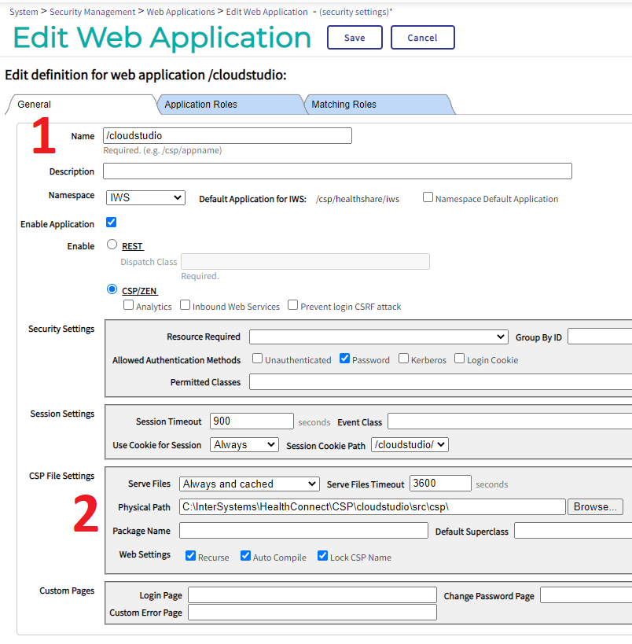
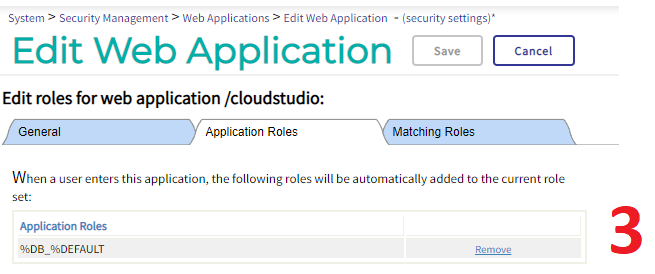

# Cloud Studio

## Introduction

Welcome to a very early Preview release of Cloud Studio, a code editor for InterSystems Iris. Documentation will follow an Alpha release.

[Video Demonstration](https://www.youtube.com/watch?v=Am6QAvrPPPg)


The project is currently "work in progress" and is at the early stages of development and testing.

Use of the project should be experimental for now.

## Installation

### ZPM Installation

zpm "install cloudstudio"

### Manual Installation

1. Download the project from GitHub and save / unpack the project files into a suitable drive + folder location.

2. Using (classic) "Studio", import CloudStudio.Index.cls into a namespace. You can make a new namespace or import it into an existing namespace.

```
/src/cls/CloudStudio.Index.cls
```

3. Configure a new web application  
  3.1. Using the "Management Portal", create a new web application, name it "/cloudstudio"  
  3.2. Configure the "Physical Path" to point to the sub folder "\src\csp\" at the location in step 1.  
  3.3 Give the application a suitable role  








4. Browse to the index page (replace port number to match your installation setup)

```
http://localhost:52773/cloudstudio/CloudStudio.Index.cls
```

## Docker support

### Prerequisites
Make sure you have [git](https://git-scm.com/book/en/v2/Getting-Started-Installing-Git) and [Docker desktop](https://www.docker.com/products/docker-desktop) installed.

### Installation 
Clone/git pull the repo into any local directory
```
git https://github.com/rcemper/Dataset-OEX-reviews.git
```
Run the IRIS container with your project: 
```
docker-compose up -d --build
```
### How to Test it
```
http://localhost:42773/cloudstudio/CloudStudio.Index.cls
```
**[or use Online Demo](https://webstudio.demo.community.intersystems.com/cloudstudio/CloudStudio.Index.cls) :**


## Roadmap

1. Release a working beta a.s.a.p
2. Make Cloud Studio a stable code editor that is fit for production
3. Continually add new features until it's a complete and battle tested IDE
4. Focus on 10x developer productivity

The project is currently in high flux as it works towards a beta release. There are numerous features that are greyed out / disabled in the app at the moment. These will be completed in the coming weeks.

**A more detailed list of requirements for the Roadmap are listed on the wiki page**

https://github.com/SeanConnelly/CloudStudio/wiki/Requirements
