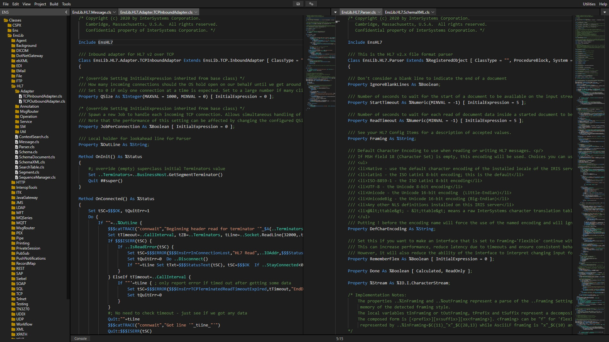

# Cloud Studio

## Introduction

Welcome to a very early preview release of Cloud Studio, a code editor for InterSystems IrisSystem.

Click on the image for a simple video demonstration.

https://www.youtube.com/watch?v=Am6QAvrPPPg

)

The project is currently "work in progress" and is at the early stages of development and testing.

Use of the project should be experimental for now.

## Roadmap

1. Make Cloud Studio a stable code editor that is fit for production
2. Continually add new features until it's a complete and battle tested IDE
3. Focus on 10x developer productivity

**A more detailed list of requirements for the Roadmap are listed on the wiki page**

https://github.com/SeanConnelly/CloudStudio/wiki
