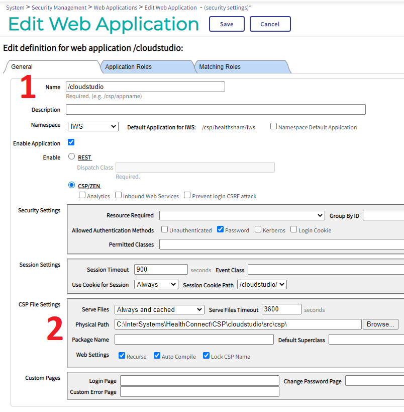
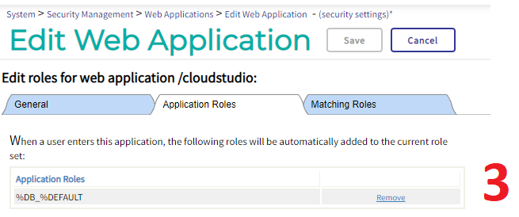

# Cloud Studio

## Introduction

A work in progress IDE for IRIS.

## Installation

### Manual Installation

1. Download the project from GitHub and save / unpack the project files into a suitable drive + folder location.

2. Using (classic) "Studio", import CloudStudio.Index.cls into a namespace. You can make a new namespace or import it into an existing namespace.

```
/src/cls/CloudStudio.Index.cls
```

3. Configure a new web application  
  3.1. Using the "Management Portal", create a new web application, name it "/cloudstudio"  
  3.2. Configure the "Physical Path" to point to the sub folder "\src\csp\" at the location in step 1.  
  3.3 Give the application a suitable role  








4. Browse to the index page (replace port number to match your installation setup)

```
http://localhost:52773/cloudstudio/CloudStudio.Index.cls
```
